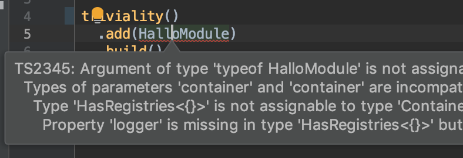

# Table of Contents

* [Installation](#installation)
* [Triviality](#triviality)
  * [Modules](#modules)
  * [Registers](#registers)
  * [Setup](#setup)
  * [Service overrides & decorators](#service-overrides-&-decorators)
    * [Override service](#override-service)
    * [Decorators](#decorators)
* [Thanks](#thanks)
* [Reads](#reads)


 [](https://travis-ci.org/epinxteren/triviality) [](https://badge.fury.io/js/triviality)   


# Installation

To install the stable version:

```
yarn add triviality
```

This assumes you are using [yarn](https://yarnpkg.com) as your package manager.

or 

```
npm install triviality
```

# Triviality

Dependency Injection is all about code reusability. 
It’s a design pattern aiming to make high-level code reusable, 
by separating the object creation / configuration from usage. **Triviality** highly aims to keep away from your application code. 
**No magic** injection with tokens, annotations whatsoever. It will use your application code 
as **strictly typed interface** to assure everything is connected properly. 

## Modules

Triviality by core is split into Modules. A module is defined as a class. Each module has his own services definitions 
so each module can serve it's unique and there separate logic.


```typescript
import { Module } from 'triviality';
import { LoggerInterface } from './LoggerInterface';

export class LogModule implements Module {
  public logger(): LoggerInterface {
    return console;
  }
}
```
        

As you can see a module class has functions. The function name is the service name. The function implementation the service factory. Before we can call the service from the container
we need to build it:


```typescript
import { ContainerFactory } from 'triviality';
import { LogModule } from './LogModule';

ContainerFactory
  .create()
  .add(LogModule)
  .build()
  .then((container) => {
    const logger = container.logger();
    logger.info('Hallo word');
  });
```
        

Now we can fetch the 'logger' service from the container and start using it. In the build step of the container function results will be memorized and can be threaded as a 
singleton based on the service factory arguments.


```typescript
import { Module } from 'triviality';
import { LoggerInterface } from '../module/LoggerInterface';
import { PrefixedLogger } from './PrefixedLogger';

export class LogModule implements Module {

  public logger(): LoggerInterface {
    return console;
  }

  public prefixedLogger(prefix: string): LoggerInterface {
    return new PrefixedLogger(this.logger(), prefix);
  }

}
```
        

The logger service function and the 'prefixedLogger' functions will always return the same instance for the same arguments. 


```typescript
import { ContainerFactory } from 'triviality';
import { LogModule } from './LogModule';

ContainerFactory
  .create()
  .add(LogModule)
  .build()
  .then((container) => {
    const johnLogger = container.prefixedLogger('John:');
    johnLogger.info('Hallo Jane!');
    const janeLogger = container.prefixedLogger('Jane:');
    janeLogger.info('Hi John!');

  });
```
        
___

The container service function types are inherited from the Modules.
This gives typescript the option to **strictly type check** if everything is connected properly. 
And you the benefits of **code completion** and the option to quickly traverse the service chain.
___

We can inject the Module with a Container that has multiple Module dependencies ```Container<...Modules>```. Let's put 
the type checking to the test, we create a nice module that dependence on the 'LogModule'. 


```typescript
import { HalloService } from './HalloService';
import { Container, Module } from 'triviality';
import { LogModule } from '../module/LogModule';

export class HalloModule implements Module {

  constructor(private container: Container<LogModule>) {
  }

  public halloService(name: string): HalloService {
    return new HalloService(this.container.logger(), name);
  }
}
```
        

Build the container with missing 'LogModule' dependency:


```typescript
import { ContainerFactory } from 'triviality';
import { HalloModule } from './HalloModule';

ContainerFactory
  .create()
  .add(HalloModule)
  .build()
  .then((container) => {
    const service = container.halloService('John');
    service.speak();
  });
```
        

If you forget a module you see a nice error of typescript in your IDE.



    Error:(6, 8) TS2345: Argument of type 'typeof HalloModule' is not assignable to parameter of type 'ModuleConstructor<HalloModule, {}>'.
      Types of parameters 'container' and 'container' are incompatible.
        Property 'logger' is missing in type '{}' but required in type 'Readonly<Pick<LogModule, "logger">>'.

Let's fix the container by adding the LogModule:


```typescript
import { ContainerFactory } from 'triviality';
import { LogModule } from '../singleton/LogModule';
import { HalloModule } from './HalloModule';

ContainerFactory
  .create()
  .add(LogModule)
  .add(HalloModule)
  .build()
  .then((container) => {
    const service = container.halloService('John');
    service.speak();
  });
```
        

```bash
./node_modules/.bin/ts-node example/moduleDependency/HalloModuleContainer.ts 
Hallo John
```
        

## Registers

Registers are a collection of services so other module can use the registered services without knowing about anything about the other module.

Let's create a register for 'console commands'


```typescript
import { Module } from 'triviality';
import { ConsoleCommand } from './ConsoleCommand';

export class ConsoleModule implements Module {

  public registries() {
    return {
      consoleCommands: (): ConsoleCommand[] => {
        return [];
      },
    };
  }

}
```
        

Like a module, the 'registries' function returns an object. The object property name is registry names. 
The implementation of the function is returns the services that needs to be added to the registry. We can define the
registry to multiple modules. In the next examples both modules returns one command service inside the registry function.
 

```typescript
import { Module } from 'triviality';
import { ConsoleCommand } from '../ConsoleCommand';
import { HalloConsoleCommand } from './HalloConsoleCommand';

export class HalloConsoleModule implements Module {

  public registries() {
    return {
      consoleCommands: (): ConsoleCommand[] => {
        return [this.halloConsoleCommand()];
      },
    };
  }

  private halloConsoleCommand() {
    return new HalloConsoleCommand();
  }

}
```
        


```typescript
import { Module } from 'triviality';
import { ConsoleCommand } from '../ConsoleCommand';
import { ByeConsoleCommand } from './ByeConsoleCommand';

export class ByeConsoleModule implements Module {

  public registries() {
    return {
      consoleCommands: (): ConsoleCommand[] => {
        return [this.byeConsoleCommand()];
      },
    };
  }

  private byeConsoleCommand() {
    return new ByeConsoleCommand();
  }

}
```
        

Multiple modules can define the registry. The implementation needs to match between modules otherwise typescript will assist you with strict type checking.
During the container build phase the registries will be combined. 


```typescript
import { Module } from 'triviality';
import { ConsoleCommand } from './ConsoleCommand';
import { ConsoleService } from './ConsoleService';
import { ProcessInput } from './ProcessInput';
import { ProcessOutput } from './ProcessOutput';
import { ConsoleInput } from './ConsoleInput';
import { ConsoleOutput } from './ConsoleOutput';

export class ConsoleModule implements Module {

  public registries() {
    return {
      consoleCommands: (): ConsoleCommand[] => {
        return [];
      },
    };
  }

  public consoleService() {
    return new ConsoleService(
      this.registries().consoleCommands(),
      this.processInput(),
      this.processOutput(),
    );
  }

  public processInput(): ConsoleInput {
    return new ProcessInput();
  }

  public processOutput(): ConsoleOutput {
    return new ProcessOutput();
  }

}
```
        

Now we can combine the different command modules and build the container.


```typescript
import { ContainerFactory } from 'triviality';
import { ConsoleModule } from './ConsoleModule';
import { HalloConsoleModule } from './Command/HalloConsoleModule';
import { ByeConsoleModule } from './Command/ByeConsoleModule';

ContainerFactory
  .create()
  .add(ConsoleModule)
  .add(HalloConsoleModule)
  .add(ByeConsoleModule)
  .build()
  .then((container) => {
    return container.consoleService().handle();
  });
```
        


```bash
./node_modules/.bin/ts-node example/registries/console.ts hallo john
Hallo john
```
        

```bash
./node_modules/.bin/ts-node example/registries/console.ts bye john
Bye john !!!
```
        

You can also fetch all registries from the container


## Setup

The build step returns a single promise, Each module can have it's own specific setup
task. The module can check if everything is configured properly or connect to external service like a database.


```typescript
import { Module } from 'triviality';
import { Database } from './Database';

export class DatabaseModule implements Module {

  public setup() {
    if (!this.database().isConnected()) {
      throw new Error('Database is not connected!');
    }
  }

  public database(): Database {
    return new Database();
  }

}
```
        

Add a catch function to gracefully handle errors


```typescript
import { ContainerFactory } from 'triviality';
import { DatabaseModule } from './DatabaseModule';

ContainerFactory
  .create()
  .add(DatabaseModule)
  .build()
  .then((container) => {
    container.database().someFancyQuery();
  })
  .catch((error) => {
    process.stdout.write(`${error}
`);
  });
```
        


```bash
./node_modules/.bin/ts-node example/setup/bootstrap.ts 
Error: Database is not connected!
```
        

## Service overrides & decorators

If you use a external module, maybe you want to override some services. For example we start with the following greetings module:


```typescript
import { Module } from 'triviality';
import { GreetingsServiceInterface } from './services/GreetingsServiceInterface';
import { CasualGreetingService } from './services/CasualGreetingService';

export class GreetingsModule implements Module {

  public greetingService(): GreetingsServiceInterface {
    return new CasualGreetingService();
  }

}
```
        

When we run 


```typescript
import { ContainerFactory } from 'triviality';
import { GreetingsModule } from './GreetingsModule';
import { LogModule } from '../module/LogModule';

ContainerFactory
  .create()
  .add(LogModule)
  .add(GreetingsModule)
  .build()
  .then((container) => {
    const logger = container.logger();
    const halloService = container.greetingService();
    logger.info(halloService.greet('Triviality'));
  });
```
        

We get:


```bash
./node_modules/.bin/ts-node example/overrides/bootstrapGreetingsModule.ts 
Hallo Triviality
```
        

### Override service

If we want to use a different we can override the 'greetingService'


```typescript
import { Container, Module, Optional } from 'triviality';
import { GreetingsModule } from './GreetingsModule';
import { FormalGreetingsService } from './services/FormalGreetingsService';
import { GreetingsServiceInterface } from './services/GreetingsServiceInterface';

export class FormalGreetingsModule implements Module {
  public serviceOverrides(): Optional<Container<GreetingsModule>> {
    return {
      greetingService: () => this.formalGreetingsService(),
    };
  }

  public formalGreetingsService(): GreetingsServiceInterface {
    return new FormalGreetingsService();
  }

}
```
        

```typescript
import { ContainerFactory } from 'triviality';
import { GreetingsModule } from './GreetingsModule';
import { LogModule } from '../module/LogModule';

ContainerFactory
  .create()
  .add(LogModule)
  .add(GreetingsModule)
  .build()
  .then((container) => {
    const logger = container.logger();
    const halloService = container.greetingService();
    logger.info(halloService.greet('Triviality'));
  });
```
        

Now the original 'greetingService' service is overridden and we get 


```bash
./node_modules/.bin/ts-node example/overrides/bootstrapFormalGreetingsModule.ts 
Pleased to meet you Triviality
```
        

### Decorators

We can still use the original service from the container. Let's be less formal by screaming the sentence: 


```typescript
import { Container, Module, Optional } from 'triviality';
import { ScreamGreetingsService } from './services/ScreamGreetingsService';
import { GreetingsModule } from './GreetingsModule';

export class ScreamGreetingsModule implements Module {
  public serviceOverrides(container: Container<GreetingsModule>): Optional<Container<GreetingsModule>> {
    return {
      greetingService: () => new ScreamGreetingsService(container.greetingService()),
    };
  }

}
```
        

```typescript
import { ContainerFactory } from 'triviality';
import { GreetingsModule } from './GreetingsModule';
import { LogModule } from '../module/LogModule';

ContainerFactory
  .create()
  .add(LogModule)
  .add(GreetingsModule)
  .build()
  .then((container) => {
    const logger = container.logger();
    const halloService = container.greetingService();
    logger.info(halloService.greet('Triviality'));
  });
```
        

Now the original 'greetingService' service is overridden and we get:


```bash
./node_modules/.bin/ts-node example/overrides/bootstrapScreamGreetingsModule.ts 
Hallo Triviality
```
        

# Thanks

Special thanks to:

* Eric Pinxteren
* Wessel van der Linden

# Reads

Triviality is inspired by [disco](https://github.com/bitExpert/disco) without the annotations.

